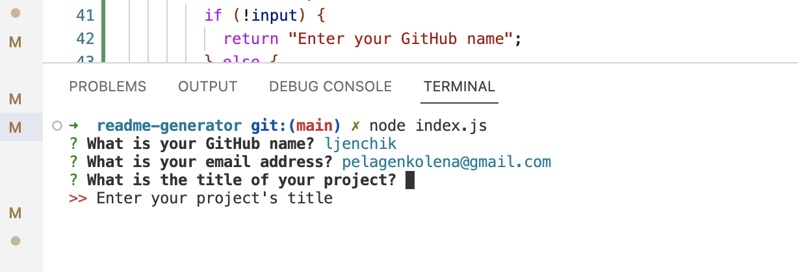
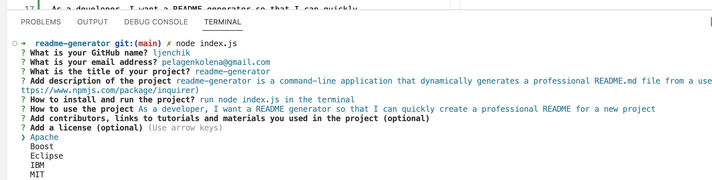
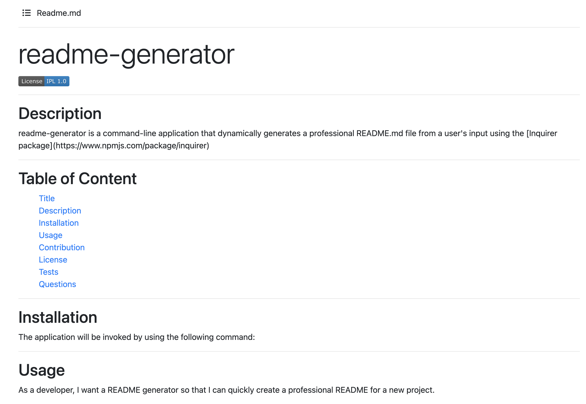
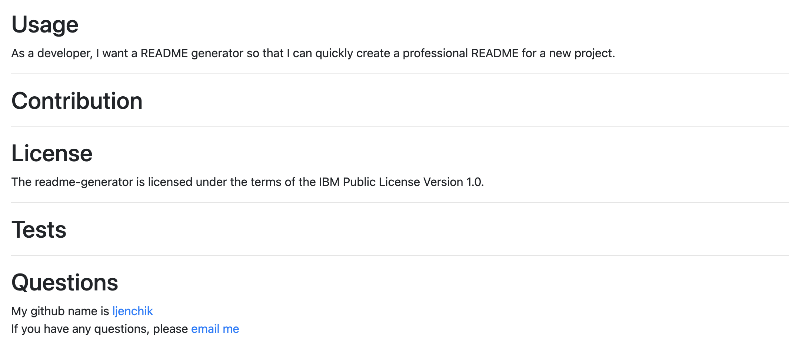

# readme-generator

## Description

readme-generator is a command-line application that dynamically generates a professional README.md file from a user's input using the [Inquirer package](https://www.npmjs.com/package/inquirer). 

## Installation

The application will be invoked by using the following command:

```bash
node index.js
```

## Usage 

As a developer, I want a README generator so that I can quickly create a professional README for a new project.

<p float="center">




</p>
